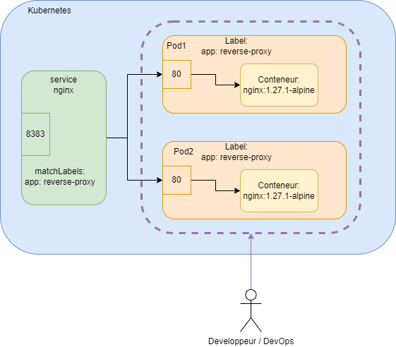
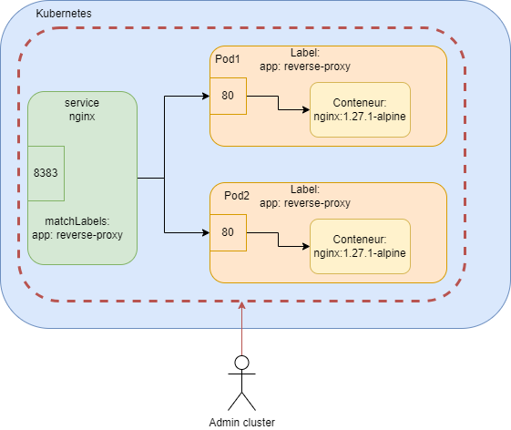

# Compte-rendu : Gestion des Namespaces Kubernetes

**Auteur :** GUILMIN Leny

---

## Table des matières

- [Compte-rendu : Gestion des Namespaces Kubernetes](#compte-rendu--gestion-des-namespaces-kubernetes)
  - [Table des matières](#table-des-matières)
  - [Création d'un namespace](#création-dun-namespace)
  - [Lister les namespaces](#lister-les-namespaces)
  - [Description d'un namespace](#description-dun-namespace)
  - [Commandes pour vérifier les events et le bon démarrage](#commandes-pour-vérifier-les-events-et-le-bon-démarrage)
  - [Lancer le site](#lancer-le-site)
  - [Questions](#questions)

---

## Création d'un namespace

Pour créer un nouveau namespace à partir d'un fichier de configuration :

```bash
kubectl apply -f front/namespace.yml
```

**Résultat :**

```bash
namespace/middle created
```

---

## Lister les namespaces

Pour afficher tous les namespaces existants dans le cluster :

```bash
kubectl get namespaces
```

**Résultat avant leurs créations :**

```bash
NAME              STATUS   AGE
default           Active   17m
kube-node-lease   Active   17m
kube-public       Active   17m
kube-system       Active   17m
```

**Résultat après leurs créations :**

```bash
NAME              STATUS   AGE
default           Active   17m
database          Active   22s
middle            Active   9s
front             Active   4s
kube-node-lease   Active   17m
kube-public       Active   17m
kube-system       Active   17m
```

**Namespaces système :**

- `default` : namespace par défaut pour les ressources sans namespace spécifié
- `kube-system` : namespace pour les composants système de Kubernetes
- `kube-public` : namespace accessible publiquement
- `kube-node-lease` : namespace pour les objets de lease des nœuds

**Namespaces personnalisés :**

- `database` : pour les ressources de base de données
- `middle` : pour la couche intermédiaire
- `front` : pour les ressources frontend

---

## Description d'un namespace

Pour obtenir des informations détaillées sur un namespace spécifique :

```bash
kubectl describe namespace front
```

**Résultat :**

```bash
Name:         front
Labels:       kubernetes.io/metadata.name=front
Annotations:  <none>
Status:       Active

No resource quota.

No LimitRange resource.
```

**Informations affichées :**

- **Name** : nom du namespace
- **Labels** : étiquettes associées au namespace
- **Status** : statut actuel (Active/Terminating)
- **Resource Quota** : quotas de ressources définis
- **LimitRange** : limites de ressources définies

---

## Commandes pour vérifier les events et le bon démarrage

Pour lister les événements dans le namespace front :

```bash
kubectl get events -n front
```

Pour lister les pods dans le namespace front :

```bash
kubectl get pods -n front
```

Pour obtenir les détails et les events des pods :

```bash
kubectl describe pods -n front
```

---

## Lancer le site

Pour accéder au site via port-forward :

```bash
kubectl port-forward -n front svc/nginx 8080:8383
```

---

## Questions

**7. À quoi correspondent les pointillés violet ?**



Les pointillés violet correspondent au deployement.

**8. À quoi correspondent les pointillés ?**



Les pointillés correspondent au namespace.
