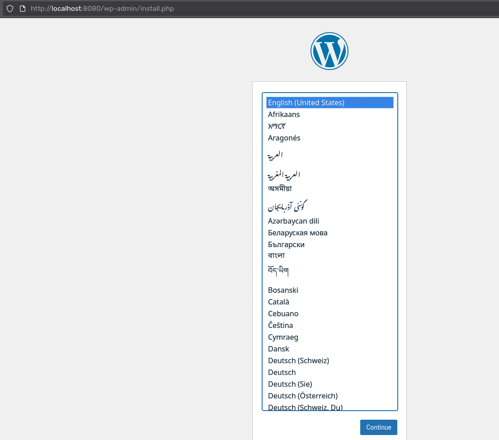

# Compte-rendu : Gestion des Namespaces Kubernetes

**Auteur :** GUILMIN Leny

---

## Table des matières

- [Compte-rendu : Gestion des Namespaces Kubernetes](#compte-rendu--gestion-des-namespaces-kubernetes)
  - [Table des matières](#table-des-matières)
    - [SQL](#sql)
    - [Wordpress](#wordpress)

---

### SQL

Une fois les fichiers crées et remplies:

```bash
$ kubectl apply -f mysql-secret.yml
$ kubectl apply -f mysql-configmap.yml
$ kubectl apply -f mysql-statefulset.yml
$ kubectl apply -f mysql-service.yml
```

Vérifions si tout fonctionne correctement:

```bash
$ kubectl get all -n database
NAME          READY   STATUS    RESTARTS   AGE
pod/mysql-0   1/1     Running   0          19m

NAME            TYPE        CLUSTER-IP     EXTERNAL-IP   PORT(S)    AGE
service/mysql   ClusterIP   10.105.0.126   <none>        3306/TCP   13d

NAME                     READY   AGE
statefulset.apps/mysql   1/1     13d

$ kubectl get pvc -n database
NAME                               STATUS   VOLUME                                     CAPACITY   ACCESS MODES   STORAGECLASS   VOLUMEATTRIBUTESCLASS   AGE
mysql-persistent-storage-mysql-0   Bound    pvc-9aea3b4e-f9b9-4f95-a1b4-8eb1328dc530   1Gi        RWO            standard       <unset>                 13d
```

```bash
$ kubectl exec -it mysql-0 -n database -- bash
bash-5.1# env | grep MYSQL
MYSQL_PORT=tcp://10.105.0.126:3306
MYSQL_PORT_3306_TCP_ADDR=10.105.0.126
MYSQL_MAJOR=innovation
MYSQL_PORT_3306_TCP_PORT=3306
MYSQL_PORT_3306_TCP=tcp://10.105.0.126:3306
MYSQL_ROOT_PASSWORD=admin2.0
MYSQL_PASSWORD=admin
MYSQL_USER=thr
MYSQL_VERSION=9.0.1-1.el9
MYSQL_SERVICE_PORT=3306
MYSQL_SERVICE_HOST=10.105.0.126
MYSQL_PORT_3306_TCP_PROTO=tcp
MYSQL_DATABASE=wordpress
MYSQL_SHELL_VERSION=9.0.1-1.el9
```

# Compte-rendu : Gestion des Namespaces Kubernetes

**Auteur :** GUILMIN Leny

---

## Table des matières

- [Compte-rendu : Gestion des Namespaces Kubernetes](#compte-rendu--gestion-des-namespaces-kubernetes)
  - [Table des matières](#table-des-matières)
  - [SQL](#sql)
  - [Wordpress](#wordpress)

---

## SQL

Une fois les fichiers créés et remplis:

```bash
$ kubectl apply -f database/mysql-secret.yml
secret/mysql-secret created

$ kubectl apply -f database/mysql-configmap.yml
configmap/mysql-configmap created

$ kubectl apply -f database/mysql-statefulset.yml
statefulset.apps/mysql created

$ kubectl apply -f database/mysql-service.yml
service/mysql created
```

Vérifions si tout fonctionne correctement:

```bash
$ kubectl get all -n database
NAME          READY   STATUS    RESTARTS       AGE
pod/mysql-0   1/1     Running   1 (7d5h ago)   7d5h

NAME            TYPE        CLUSTER-IP      EXTERNAL-IP   PORT(S)    AGE
service/mysql   ClusterIP   10.102.75.101   <none>        3306/TCP   7d5h

NAME                     READY   AGE
statefulset.apps/mysql   1/1     7d5h
```

```bash
$ kubectl get pvc -n database
NAME                               STATUS   VOLUME                                     CAPACITY   ACCESS MODES   STORAGECLASS   VOLUMEATTRIBUTESCLASS   AGE
mysql-persistent-storage-mysql-0   Bound    pvc-9aea3b4e-f9b9-4f95-a1b4-8eb1328dc530   1Gi        RWO            standard       <unset>                 7d5h
```

Vérification des variables d'environnement dans le pod MySQL:

```bash
$ kubectl exec -it mysql-0 -n database -- bash
bash-5.1# env | grep MYSQL
MYSQL_USER=thr
MYSQL_PASSWORD=admin
MYSQL_ROOT_PASSWORD=admin2.0
MYSQL_DATABASE=wordpress
MYSQL_PORT_3306_TCP_ADDR=10.102.75.101
MYSQL_PORT_3306_TCP_PORT=3306
MYSQL_PORT=tcp://10.102.75.101:3306
MYSQL_SERVICE_HOST=10.102.75.101
MYSQL_SERVICE_PORT=3306
MYSQL_PORT_3306_TCP=tcp://10.102.75.101:3306
MYSQL_PORT_3306_TCP_PROTO=tcp
MYSQL_MAJOR=innovation
MYSQL_VERSION=9.0.1-1.el9
MYSQL_SHELL_VERSION=9.0.1-1.el9
bash-5.1# exit
```

---

## Wordpress

### 1. Création du PersistentVolume

```bash
$ kubectl apply -f middle/wordpress-pv.yml
persistentvolume/wordpress-pv created
```

### 2. Création du PersistentVolumeClaim

```bash
$ kubectl apply -f middle/wordpress-pvc.yml
persistentvolumeclaim/wordpress-pvc created
```

Vérification des volumes:

```bash
$ kubectl get pv,pvc -n middle
NAME                             CAPACITY   ACCESS MODES   RECLAIM POLICY   STATUS   CLAIM                   STORAGECLASS   VOLUMEATTRIBUTESCLASS   REASON   AGE
persistentvolume/wordpress-pv    100Mi      RWX            Retain           Bound    middle/wordpress-pvc    manual         <unset>                          5m

NAME                                  STATUS   VOLUME         CAPACITY   ACCESS MODES   STORAGECLASS   VOLUMEATTRIBUTESCLASS   AGE
persistentvolumeclaim/wordpress-pvc   Bound    wordpress-pv   100Mi      RWX            manual         <unset>                 5m
```

### 3. Déploiement du Secret MySQL dans le namespace middle

```bash
$ kubectl apply -f database/mysql-secret.yml -n middle
secret/mysql-secret created
```

### 4. Déploiement du ConfigMap MySQL dans le namespace middle

```bash
$ kubectl apply -f database/mysql-configmap.yml -n middle
configmap/mysql-configmap created
```

### 5. Création du Deployment WordPress

```bash
$ kubectl apply -f middle/wordpress-deployment.yml
deployment.apps/wordpress created
```

Vérification du déploiement:

```bash
$ kubectl get pods -n middle
NAME                         READY   STATUS    RESTARTS   AGE
wordpress-54df99f8d7-pc9jw   1/1     Running   0          2m
```

### 6. Création du Service WordPress

```bash
$ kubectl apply -f middle/wordpress-service.yml
service/wordpress-service created
```

Vérification de toutes les ressources:

```bash
$ kubectl get all,pvc -n middle
NAME                             READY   STATUS    RESTARTS   AGE
pod/wordpress-54df99f8d7-pc9jw   1/1     Running   0          5m42s

NAME                        TYPE        CLUSTER-IP      EXTERNAL-IP   PORT(S)   AGE
service/wordpress-service   ClusterIP   10.101.246.63   <none>        80/TCP    4m

NAME                        READY   UP-TO-DATE   AVAILABLE   AGE
deployment.apps/wordpress   1/1     1            1           5m42s

NAME                                   DESIRED   CURRENT   READY   AGE
replicaset.apps/wordpress-54df99f8d7   1         1         1       5m42s

NAME                                  STATUS   VOLUME         CAPACITY   ACCESS MODES   STORAGECLASS   VOLUMEATTRIBUTESCLASS   AGE
persistentvolumeclaim/wordpress-pvc   Bound    wordpress-pv   100Mi      RWX            manual         <unset>                 8m
```

### 7. Vérification des variables d'environnement dans le pod WordPress

```bash
$ kubectl exec -it wordpress-54df99f8d7-pc9jw -n middle -- env | grep WORDPRESS
WORDPRESS_DB_USER=thr
WORDPRESS_DB_NAME=wordpress
WORDPRESS_DB_HOST=mysql.database.svc.cluster.local
WORDPRESS_DB_PASSWORD=admin
```

### Accès à WordPress via port-forward

```bash
$ kubectl port-forward -n middle svc/wordpress-service 8080:80
Forwarding from 127.0.0.1:8080 -> 80
Forwarding from [::1]:8080 -> 80
```

## NGINX

### 1. Création du ConfigMap NGINX

```bash
$ kubectl apply -f front/nginx-cm.yml
configmap/nginx-config created
```

### 2. Déploiement de NGINX

```bash
$ kubectl apply -f front/nginx-deployment.yml
deployment.apps/nginx created

$ kubectl apply -f front/nginx-service.yml
service/nginx created
```

### 3. Vérification des ressources

```bash
$ kubectl get all -n front
NAME                         READY   STATUS    RESTARTS   AGE
pod/nginx-5f79bdf57d-zzgb2   1/1     Running   0          7m6s

NAME            TYPE        CLUSTER-IP     EXTERNAL-IP   PORT(S)   AGE
service/nginx   ClusterIP   10.99.71.151   <none>        80/TCP    7d7h

NAME                    READY   UP-TO-DATE   AVAILABLE   AGE
deployment.apps/nginx   1/1     1            1           7m6s

NAME                               DESIRED   CURRENT   READY   AGE
replicaset.apps/nginx-5f79bdf57d   1         1         1       7m6s
```

### 4. Accès au site WordPress via NGINX

```bash
$ kubectl port-forward -n front svc/nginx 8080:80
Forwarding from 127.0.0.1:8080 -> 80
Forwarding from [::1]:8080 -> 80
```



---

## Vérifications

### ❓ Les différentes ressources sont déployées dans le bon namespace ? Quelle commande utilisez-vous pour vérifier cela ?

**Réponse :**

Oui, les ressources sont déployées dans les bons namespaces.

**Commandes de vérification :**

```bash
$ kubectl get all,secret,configmap,pvc -n database
$ kubectl get all,secret,configmap,pvc -n middle
$ kubectl get all,secret,configmap -n front
```

---

### ❓ Les ressources MySQL ConfigMap et MySQL Secret sont à déployer au sein des namespaces middle et database, pourquoi ?

**Réponse :**

Un pod ne peut utiliser que les ressources de son propre namespace. Comme MySQL est dans database et WordPress dans middle, on doit créer les ConfigMap et Secret dans les deux namespaces.

Mais on peut très bien utiliser -n afin de specifier le namespace dans la commande kubectl.

---

### ❓ Les différents pods sont-ils correctement démarrés ? Quelle commande utilisez-vous pour vérifier cela ?

**Réponse :**

Oui, tous les pods sont correctement démarrés avec le statut `Running` et `READY 1/1`.

**Commande de vérification :**

```bash
$ kubectl get pods --all-namespaces
```

Pour voir les détails d'un pod spécifique :
```bash
$ kubectl describe pod <pod-name> -n <namespace>
```

---

### ❓ Lorsqu'un pod est en erreur comment accédez-vous aux events du namespace et aux logs du pod ? Quelles commandes utilisez-vous pour vérifier cela ?

**Réponse :**

**Events du namespace :**

```bash
$ kubectl get events -n <namespace>
```

**Logs du pod :**

```bash
$ kubectl logs <pod-name> -n <namespace>
```

**Description du pod :**

```bash
$ kubectl describe pod <pod-name> -n <namespace>
```
